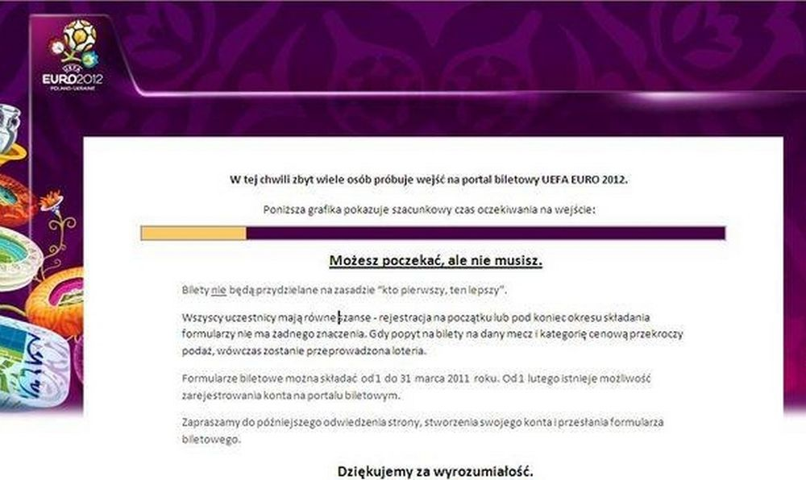
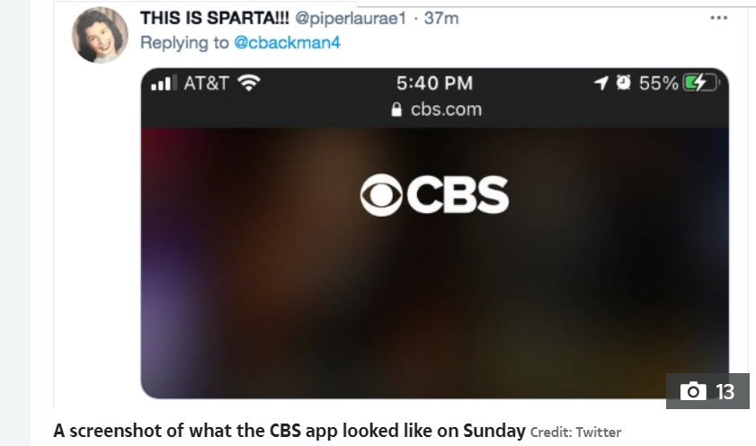

Problemy wydajnościowe aplikacji mają różne przyczyny i konsekwencje. Jest też wiele możliwych odpowiedzi i rozwiązań, które można zastosować.

#### 01.03.2011 - uefa.com
**Sytuacja**: Nie można zarejestrować się w loterii biletowej na UEFA 2012

**Konsekwencja**: Biznesowa - niewielka, popyt jest wielokrotnie wyższy niż podaż. Doświadczenie użytkownika - fatalne. 

**Przyczyna**: Zbyt duża liczba użytkowników próbujących wejść na stronę w tym samym czasie.  

    `żródło: https://www.rp.pl/artykul/619791-Bilety-na-Euro-2012--strona-UEFA-z-biletami-nie-dziala.html?fbclid=IwAR10hMsIeX1xZXT8XABpN2RqTlNKNhPEDnr7FzndcPhrnHoZE4VU84tz-QA`

*** 
#### 29.04.2021 - login.gov.pl
**Sytuacja**: Nie działa ZUS i pacjent.gov.pl z powodu niedostępnośći login.gov.pl

**Konsekwencja**: Nie można się zarejestrować na szczepienie COVID-19. Nie można się zalogować do wielu zależnych serwisów rządowych w tym do ZUS-u.

**Przyczyna**: Prawdopodobnie login.gov.pl nie był przygotowany na tak duży ruch spowodowany próbą rejestracji na szczepienie grupy 30-40 latków  

    `żródło: własne`

*** 
#### 7.02.2021 - CBS/SuperBowl
**Sytuacja**: Nie działała transmisja SuperBowl 

**Konsekwencja**: SuperBowl to najbardziej dochodowe wydarzenie sportowe na świecie. 30s reklamy kosztuje 5.6 mln $. Formy wykupujące reklamy liczą na odpowiedni zasięg.
                  Niedostępność medium zmniejsza zasięg i może być powodem żądań rekompensaty.

**Przyczyna**: Zbyt wielu użytkowników  

    `żródło: https://www.the-sun.com/news/2290209/super-bowl-2021-cbs-all-access-down/#`
