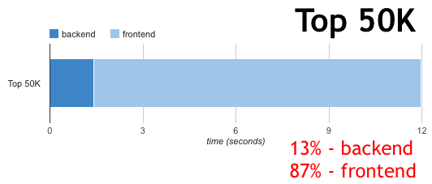
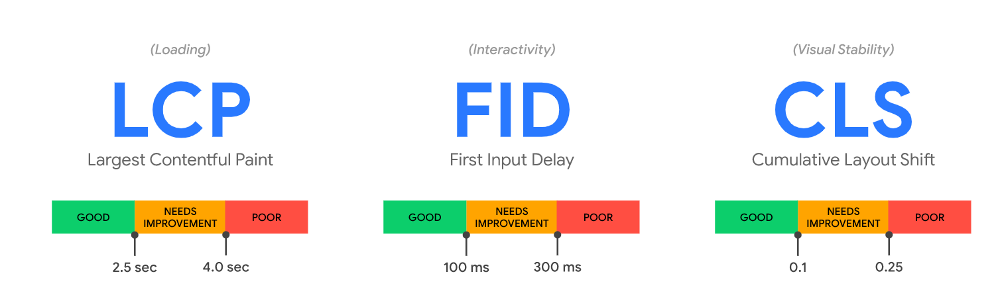
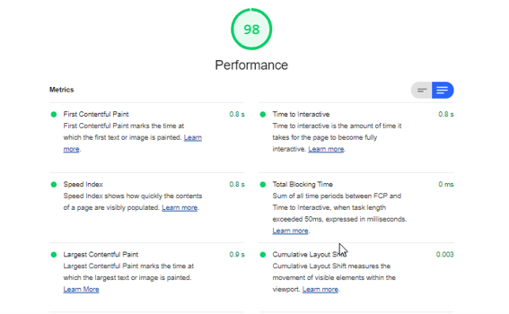
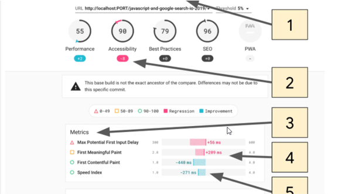
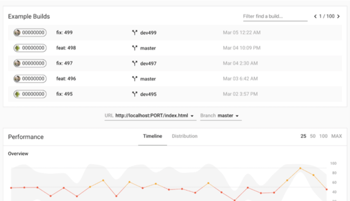

# Rodzaje testów wydajnościowych i nomenklatura

## AUT(application under test) - model warstwowy aplikacji

Aplikacje w szczególności webowe można opisać jako składające się z frontendu i backendu. Czasami spotkamy się z modelem warstowym gdzie wyrózniamy warstwę prezentacji, logiki i danych.
Frontend (To co wyświela przeglądarka, Aplikacja Desktopowa) testuje sie inaczej niż Backend (Serwer aplikacji, api, baza). Ważne są inne metryki, mamy do czynienia z innym podejściem.
Najprościej myśleć o frontendzie jako czymś co prezentuje rezultaty otrzymane z backendu i pozwala nam wchodzić w interakcje z systemem. Backend generuje rezultaty w odpowiedzi na żądania z forntendu, które są konsekwencją
akcji użytkonwika np. kliknięcia w przycisk. Frontend jest dla użytkownika a z  backendem powinny "rozmawiać" programy. W świecie aplikacji webowych frontend top strona w przeglądarce a backend to np. API serwer i baza MySQL.  

    `żródło: Gabriel Starczewski`
    
- Jakie znacie przykłady serwera aplikacji?
- Jakie znacie bazy danych?
- Jakie technologie frontendowe znacie? Co może być frontendem ?

## zlota zasada testowania wydajności

> 80-90% of the end-user response time is spent on the frontend. Start There.
>
> [Steve Souders, Google’s Head Performance Engineer, 2007](http://www.stevesouders.com/blog/2012/02/10/the-performance-golden-rule/)

Czas związany z Backendem = TTFB

Czas związany z Frontendem = cala reszta

Tak wyglądają proporcje czasu dla 50 000 stron z [HTTP Archive](http://httparchive.org/).

`żrodło: https://www.stevesouders.com/blog/2012/02/10/the-performance-golden-rule/`

## front-end vs back-end

Jakie czynniki mają najczęściej wpływ na wydajnośc frontendu ?

- połączenie sieciowe
- rodzaj klienta (PC, Smartphone)
- Parametry klienta np. CPU, karta graficzna
- na ogół wydajnośc frontendu badamy z perspektywy jednego użytkownika w izolacji od backendu

Jakie czynniki mają najczęściej wpływ na wydajnośc backendu ?

- liczba równoległych sesji, żadań, zadań
- wolumen danych

### lighhouse metrics
Core Web Vitals

`żrodło: https://web.dev/vitals/`

Google ogłosił, że Core Web Vitals będą miały wpływ na pozycjonowanie strony od maja 2021.

`żrodło: https://developers.google.com/search/blog/2020/11/timing-for-page-experience`

Links:
- https://github.com/GoogleChrome/web-vitals

### lighhouse Ci server metrics

## load testy
## stress testy
## peak capacity testy 
## testy A/B
## chaos engineering attacks
## reliability testing

