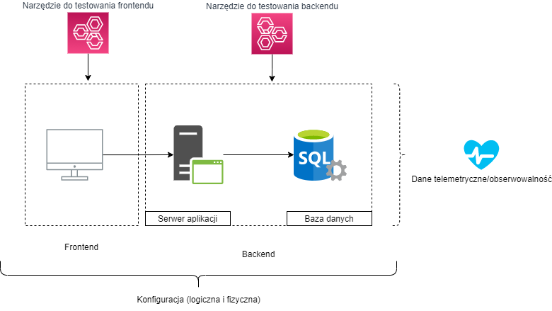

# Rodzaje testów wydajnościowych i nomenklatura

## model warstwowy aplikacji (abstrakcja)

    `żródło: własne`
    
- Jakie znacie przykłady serwera aplikacji?
- Jakie znacie bazy danych?
- Jakie technologie frontendowe znacie?

## front-end vs back-end
## load testy
## stress testy
## peak capacity testy 
## testy A/B
## chaos engineering attacks

