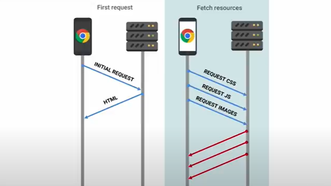

#Jak działa HTTP i co robi przeglądarka? 
***
## HTTP 


    `żrodło: https://developer.mozilla.org/en-US/docs/Learn/Getting_started_with_the_web/How_the_Web_works`

Nie ma odpowiedzi bez żądania. Serwer nie może wysłać wiadomości pierwszy.

HTTP metody:    
- GET /home
- POST
- PUT
- HEAD
- OPTIONS

Resources:
- HTML
- CSS
- JavaScript
- Media

```powershell
    Invoke-WebRequest
```
```sh
    curl -X GET http://bing.com
```

## Co robi przeglądarka
***



    `żródło: https://www.youtube.com/watch?v=oZkfApkWgPc&t=369s`