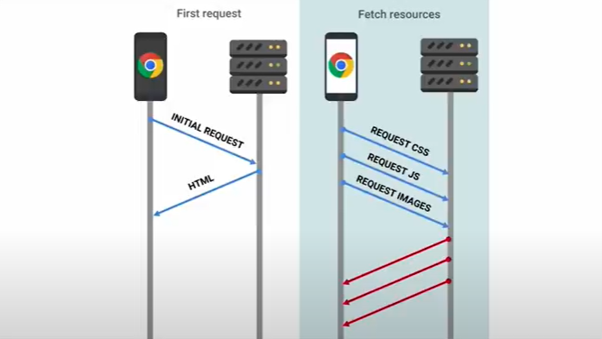

#Jak działa HTTP i co robi przeglądarka? 
***
## HTTP 

Protokołem komunikacyjnym aplikacji webowych jest HTTP. Opisuje on jaką akcję chcemy wykonać względem określonego zasobu (na serwerze).


    `żrodło: https://developer.mozilla.org/en-US/docs/Learn/Getting_started_with_the_web/How_the_Web_works`

Jest to protokół oparty na schemacie Żądanie-Odpowiedź. Nie ma odpowiedzi bez żądania. Serwer nie może wysłać wiadomości pierwszy (dlatego powstają takie technologie jak WebSockets).

Metody HTTP:    
- GET - pobranie reprezentacji zasobu
- HEAD - to samo co GET ale bez zawartości
- POST - stworzenie zasobu
- PUT - zamiana zasobu
- PATCH - częściowa modyfikacja zasobu
- DELETE - usunięcie zasobu
- OPTIONS - zapytanie o opcje komunikacji dla zasobu
- TRACE - test komunikacji do zasobu
- CONNECT - ustanowienie tunelu do zasobu (np. w web socketach, HTTPS)

``żródło: https://developer.mozilla.org/en-US/docs/Web/HTTP/Methods``


### struktura komunikatów HTTP

Żądania/Odpowiedzi składają się z :

- linii startowej (start line)
- nagłówków (headers)
- pustej linii
- ciała/zawartości (body)


``źródło: https://developer.mozilla.org/en-US/docs/Web/HTTP/Messages``


Korzystając z protokołu HTTP względem zasobów stron webowych używamy klientów HTTP (i tak można symulować działanie przeglądarki)

Przydatne komendy:

Linux
```powershell
    Invoke-WebRequest -Uri https://bing.com -Method GET
```
Windows
```console
    curl -X GET https://bing.com
```

Zasobami, które najczęściej pobieramy w trakcie interakcji ze stronami webowymi to
:
- HTML (document)
- CSS (stylesheet)
- JavaScript (script)
- Media (img)
- Czcionki (fonts)

Podstawowa różnica między zwykłym klientem HTTP i przeglądarką jest to, że:
- przeglądarka interpretuje Javascript
- przeglądarka wyświetla kompletnie przeprocesowaną zawartość strony użytkownikowi

W testach wydajnościowych musimy rozumieć jak działa przeglądarka lecz na codzień pracujemy bezpośrednio z żądaniami HTTP. 

**Zadanie**:

Z pomocą linii polecen (bash/powershell) dla dowolnego adresu URL spróbuj wykonać metody HEAD,GET,TRACE, OPTIONS

## Co robi przeglądarka
***



    `żródło: https://www.youtube.com/watch?v=oZkfApkWgPc&t=369s`
    
## Co jeszcze robi przeglądarka?

### CORS, ciasteczka, cache
### pre-fligh requests, fetch and AJAX calls