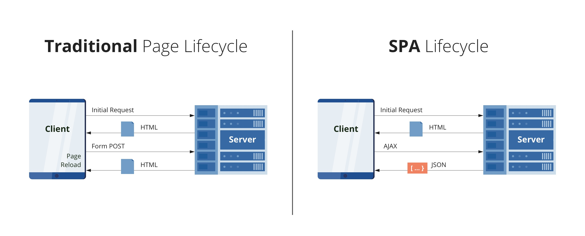

#Rodzaje AUT (Application-Under-Test): SPA, MPA, API
***

Najczęściej spotykane rodzaje AUT to SPA, MPA, API. ... Co to znaczy?

## MPA

W aplikacjach typu MPA każde żądanie 

***
## SPA
***
## API

## A teraz zapoznajmy się z naszą aplikacją :)