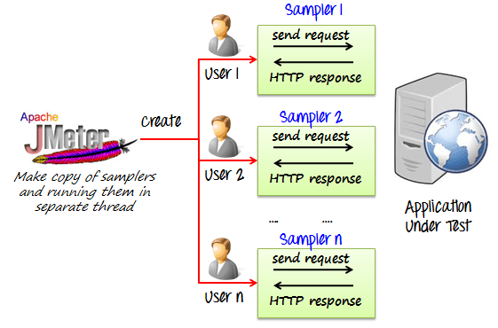

# JMeter

JMeter to prawdopodobnie najpopularniejsze obecnie narzędzie do testów wydajnościowych ogólnego przeznaczenia na świecie.
Jest napisane w Javie. Testy piszemy w GUI. Uruchamiamy je z GUI bądź linii poleceń (https://jmeter.apache.org/).

Tryb z 1 generatorem obciążenia:

        
        źródłó: https://ducmanhphan.github.io/2020-01-21-How-to-use-JMeter-to-test-performance/
        
Tryb z wieloma generatorami obciążenia (worker-controller aka master-slave)

1. Wspiera testowanie:

    - Web - HTTP, HTTPS (Java, NodeJS, PHP, ASP.NET, …)
    - SOAP / REST Webservices
    - FTP
    - Database via JDBC
    - LDAP
    - Message-oriented middleware (MOM) via JMS
    - Mail - SMTP(S), POP3(S) and IMAP(S)
    - Native commands or shell scripts
    - TCP
    - Java Objects
    
2. Posiada IDE/CLI
3. Jest wysoce konfigurowalny i rozszerzalny przez pluginy
...