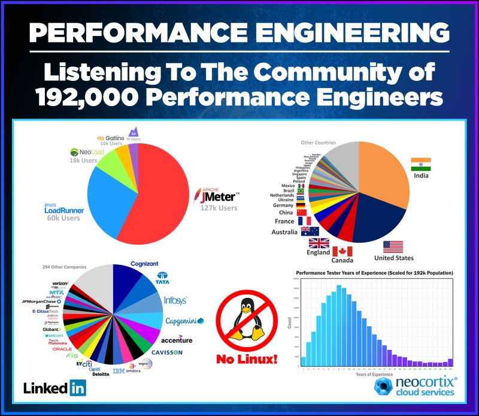

# JMeter

JMeter to prawdopodobnie najpopularniejsze obecnie narzędzie do testów wydajnościowych ogólnego przeznaczenia na świecie.

        żródło: https://www.linkedin.com/in/lloyd-watts-5523374/

Jest napisane w Javie. Testy piszemy w GUI. Uruchamiamy je z GUI bądź linii poleceń (https://jmeter.apache.org/). 

#### JMeter może pracować w trybie "standalone" i "distributed".

Tryb z 1 generatorem obciążenia (standalone):

        
        źródłó: https://ducmanhphan.github.io/2020-01-21-How-to-use-JMeter-to-test-performance/
        
Tryb z wieloma generatorami obciążenia (worker-controller aka master-slave aka distributed)

#### Wspiera testowanie:

    - Web - HTTP, HTTPS (Java, NodeJS, PHP, ASP.NET, …)
    - SOAP / REST Webservices
    - FTP
    - Database via JDBC
    - LDAP
    - Message-oriented middleware (MOM) via JMS
    - Mail - SMTP(S), POP3(S) and IMAP(S)
    - Native commands or shell scripts
    - TCP
    - Java Objects
    
#### Posiada IDE/CLI
#### Jest wysoce konfigurowalny i rozszerzalny przez pluginy
...

- Podczas pracy z JMeterem będziemy symulować użytkownika wykonujące akcje na naszym systemie (scenariusz)
- Dodatkowo będziemy logować liczbę postów w systemie przed i po teście.
- Test zaloguje również wersję aplikacji, którą testujemy.
- Przez cały czas dodawać będziemy nowe elementy i refaktoryzować test w oparciu o dobre praktyki.

