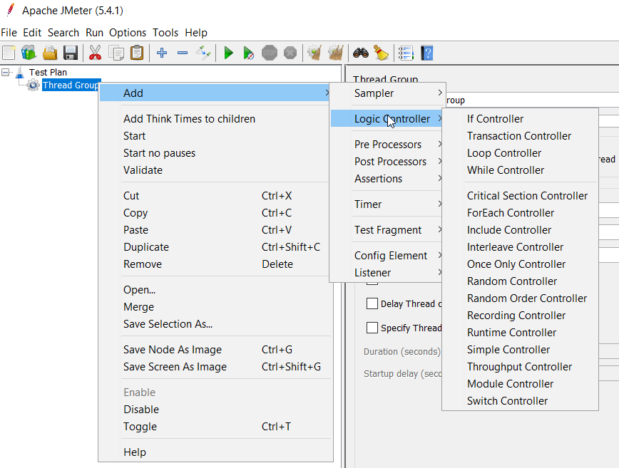

## Kontrolery logiki



Przypomnijmy sobie, że:

**Kontrolery logiki** - sterują przepływem programu, są to np. if, for, while, ... znane nam z programowania. Wykonują się z tym samym priorytetem co samplery.

**Samplery** - wykonują jednostkę pracy np. wysyłają żądanie HTTP

Przykład:

***
**Interleave controller** - Dla każdego wątka, w każdym przebiegu wykonany zostanie jeden, kolejny element z grupy

```
    Interleave Controller
        /sampler1
        /sampler2
        /sampler3
```

Pętla 1: /sampler1
Pętla 2: /sampler2
Pętla 3: /sampler3
***

**IF** - akcja/część testu zdefiniowana pod tym kontrolerem wykona się jeśli warunek logiczny (wyrażenie), który IF ewaluuje jest równy logicznemu `true` lub wartość jest 'true'
> official docs: performs actions underneath if logical condition is true

W najprostszej formie warunek powinien być zmienną zawierającą true lub false:

    ${zmienna} //zmienna=true|false

Tutaj się zatrzymam i zrobimy demo z [test-0070-demo.md](test-0070-demo.md) aby to zobrazować.

***

Jak może wyglądać bardziej skomplikowane wyrażenie w IF ?:

Można w warunku użyć JavaScript (variable expression odznaczone)

```javascript 
    JS1: ${JMeterThread.last_sample_ok} - returns true, executes if last sample in execution chain was OK
    JS2: "${loops}"=="2" - evaluates to true
    JS3: "${performIf}" or ${performIf}, Given performIf is set to "true"
    JS4: var a = function(){ return true;}; a(); - anonymous function in JS
    JS5: var a = function() {return "${loops}"==="2";};a(); - plain JS executed, strict comparisom
```
***
lub Groovy (variable expression zaznaczone)
```groovy 

    Groovy1: ${__groovy("${loops}"=="2")} , with Variable Expression checked
    Groovy2: ${__groovy(${loops} as int==2)}, alternative
```

Wróćimy do tego tematu po zapoznaniu się z elementami programowalnymi w JMeter.
JMeter rekomenduje Groovy jako język skryptowy do elementów JMeter ze względu na wydajność.
