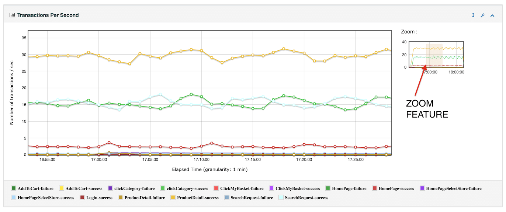

## Raporty i linia poleceń

Testy w Jmeter powinny zawsze być uruchamiane z linii poleceń w trybi niegraficznym (-n). Żeby wyświetlić dozwolone parametry wpisz

        C:\Users\gstarczewski\tools\apache-jmeter-5.4.1\bin\jmeter.bat -n

(zmień ścieżkę tak, aby odpowiadała lokalizacji Twojej na dysku)

Najprzydatniejsze opcje:

- -t, ścieżka do pliku .jmx
- -j, lokalizacja loga
- -l, lokalizacja pliku z wynikami 
- -f, nadpisanie istniejących plików z wynikami
- -e, wygenerowanie raportu HTML
- -o, folder, do którego generujemy raport
- -p, lokalizacja pliku jmeter.properties
- -q, lokalizacja plików .properties użytkownika
- -J, specyfikacja parametru lokalnego
- -G, specyfikacja parametru globalnego (w testowaniu rozproszonym)
- -R, lista zdalnych hostów, na których uruchomić testy

Przykład:

        C:\Users\gstarczewski\tools\apache-jmeter-5.2.1\bin\jmeter.bat -n -t test.jmx

> Przed uruchomieniem testu usuń z planu lub wyłącz zbędne elementy, szczególnie listenery