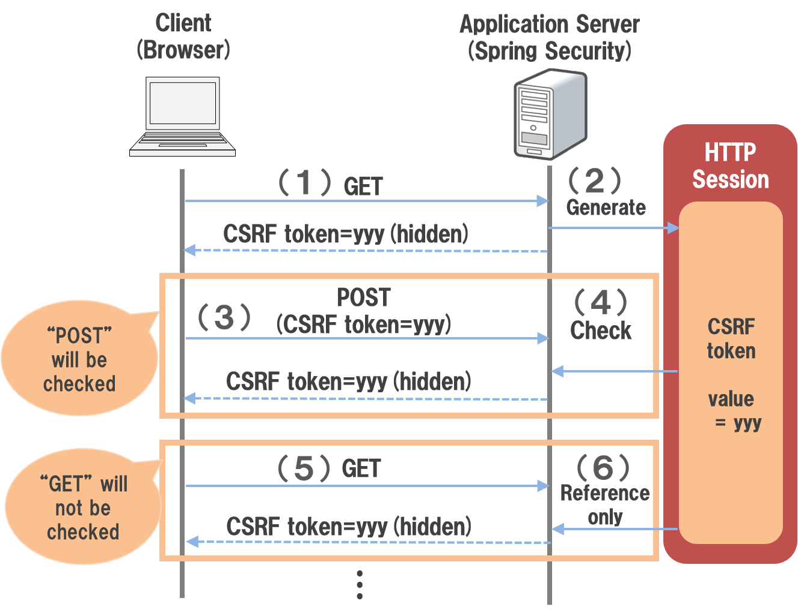

## Ekstraktory

W testach często zachodzi potrzeba wyekstrahowania jakiejś wartości z odpowiedzi HTTP, ciała tej odpowiedzi lub nagłówka, i użycie tej wartości w dalszej części testów.
Do ekstrakcji używamy Ekstraktórów, których w JMeterze jest kilka rodzajów:

- CSS - do parsowania dokumentów HTML : https://www.w3schools.com/cssref/css_selectors.asp
- XPath2.0 - do parsowania dokumentów XML: https://www.w3schools.com/xml/xpath_syntax.asp (XPath nie jest już rekomendowany)
- JSONPath - do parsowania obiektów JSON: https://support.smartbear.com/alertsite/docs/monitors/api/endpoint/jsonpath.html
- JMESPath - do parsowania obiektów JSON: https://jmespath.org/ https://jmespath.org/tutorial.html
- Boundary Extractor - do prostych ekstrakcji z testów 
- Regular Expression Extractor - najbardziej zaawansowany i skomplikowany ekstraktor ogólnego przeznaczenia

Najczęściej ekstrahowane elementy to:
 
 - wersja aplikacji
 - tokeny CSRF
 - tokeny dostępowe

        żródło: terasoluna.org
 
Pamiętaj:

- Do HTMLa - CSS
- Do XMLa - XPATH 2.0 (szybszy, więcej funckjonalności ale wymaga dobrego HTMLa)
- Do JSONa - JMSE
- Regex kosztuje
- Używaj domyślnych wartości w ekstraktorach