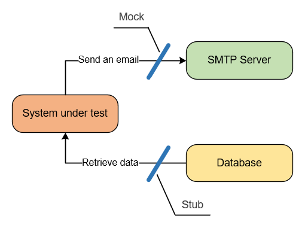

## Ekstraktory

Eskstraktory są dobrym przykładem wykorzystania elementu JMeterowego do odpowiedzi w celu przetworzenia jej w zaawansowany sposób.
Często niepraktyczne jest uruchamianie całego testu po to tylko, żeby móc pracować na odpowiedzi z serwera i testować ekstraktory lub inne zaawansowane elementy.

Podejściem, które ułatwi nam pracę nad takimi elementami jest mockowanie/stubbing (zaślepianie). Skorzystamy z następujących elementów:

- setUp thread groupa
- dummy sampler (zewnętrzny plugin)
- opcja Validate

aby usprawnić sobie pracę z ekstraktorami (stworzymy zaślepkę) . "Stuby" te w pewnym sensie będzie można też traktować jako testy bardziej zaawansowanych logik.

       
        źródło: https://enterprisecraftsmanship.com/posts/when-to-mock/

 
 > **Mocks** help to emulate and examine outcoming interactions. These interactions are calls the system under test (SUT) makes to its dependencies to change their state.
   
>  **Stubs** help to emulate incoming interactions. These interactions are calls the SUT makes to its dependencies to get input data.