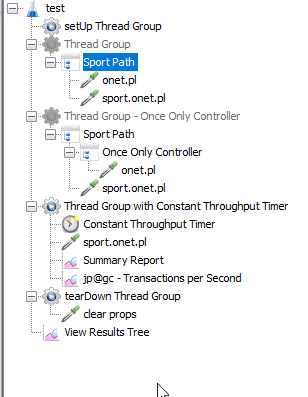

W tej cz麝ci stworzymy podstawowy test, w kt躁ym 

1) dodamy 3 grupy w졊k雕 pokazuj젺ych przyk쓰d u쯫cia
2) Pierwsza b師zie mia쓰 Transaction Controller i 2 requesty pod nim: sport.onet.pl, onet.pl
4) Druga b師zie mia쓰 dodatkowo Constant Throughput Timer - 60 req/min 
5) Ostatnia b師zie zawiera쓰 Once Only Controller dla 찣dania: onet.pl

