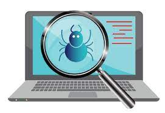

## Debugowanie w³asnych testów



        Ÿród³ó: javatpoint.com

Podstawowe elementy, któruch mo¿esz u¿yæ do debugowania testów w JMeterze to:

- Opcje 'Log Level'  && Log viewer w GUI
- Listenery róznego rodzaju np Tree  Listener
- Selektywne debugowanie pojedynczych elementów w GUI -> Help -> Enable Debug 
- jmeter.log. jmeter-server.log jeœli testy s¹ uruchamiane w trybie niegraficznym
- Debug PostProcesor


Non-GUI:

Poziom logowania z linii poleceñ mo¿na zmieniaæ [przez parametr](https://jmeter.apache.org/usermanual/get-started.html)  -LDEBUG np:
```powershell
        Invoke-Expression "$path\jmeter.bat -LDEBUG -f -n -t $testName -j logs\jmeter.log -l results\results.csv" 
```