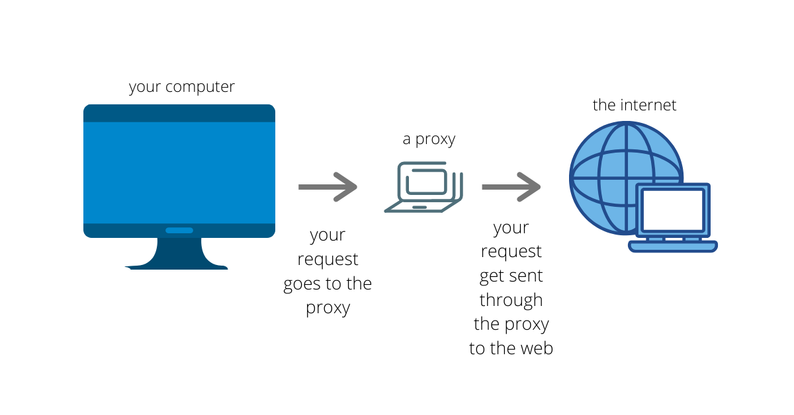

## Nagrywanie ruchu HTTP i jego odtwarzanie

W testach wydajnoœciowych stosujemy wzorzec "record-correlate-replay". Nagrywamy ruch, korelujemy zmienne, odgrywamy przygotowany w ten sposób test.

        `¿ród³ó: www.freecodecamp.org`
        
        
JMeter posiada wbudowany element do nagrywania ruchu poprzez proxy w przegl¹darce. W skrócie nagrywanie sk³ada siê z nastêpuj¹cyh kroków:
- konfiguracja przegl¹darki tak, ¿eby ruch przechodzi³ przez proxy, którym jest nagrywarka JMeterowa
- symulacja sesji u¿ytkownika w przegl¹darce
- korelacja zmiennych w nagranym teœcie tj. access tokeny, has³a, loginy, csrf tokeny i inne wartoœci dynamiczne
- oczyszczenie i urealistycznienie skryptu

Kiedy u¿ywaæ:

- nie znamy aplikacji (nie budujemy jej w oparciu o np. OpenAPI)
- aplikacja jest skomplikowana lub nagrywana sesja bardzo d³uga 
- aplikacja czêsto siê zmienia
- do debugowania
- kiedy potrafimy budowaæ testy w JMeterze sami

