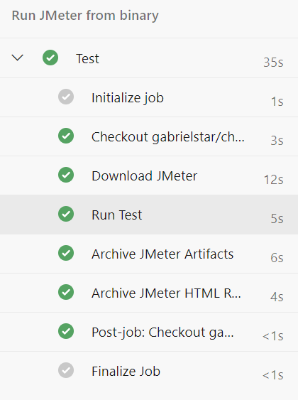
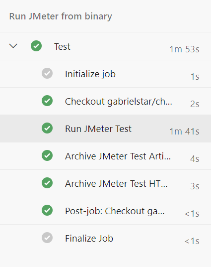

## JMeter w Azure DevOps

Azure DevOps to portal do automatyzacji procesów deweloperskich, który mo¿e korzystaæ z zasobów Azure (z Azure Portal) jak i spoza niego (no. GitHub) poprzez 
linki, które nazywamy Service Connections.

***

Wykonanie testów w systemie CI/CD (Azure DevOps lub innym) to nic innego jak automatyzacja. Zanim bêdziemy automatyzowaæ musimy wiedzieæ co automatyzujemy. Opiszmy wiêc zadanie w postaci kroków:

- Pobierz repozytorium z testami (wymagane)
- Zainstaluj JMetera (wymagane)
- Uruchom Testy (wymagane)
- Opublikuj wynik testów (opcjonalne)
- Opublikuj artefakty testowe (opcjonalne)

Do automatyzacji wykorzystujemy pipeline'y. Automatyzacjê implementujemy korzystaj¹c z gotowych elementów pipeline'a (stepów) lub rozszerzeñ, które mo¿emy zainstalowaæ z Azure Marketplace. 

Pipeline w Azure Devops ma nastêpuj¹c¹ [strukturê](https://docs.microsoft.com/en-us/azure/devops/pipelines/yaml-schema?view=azure-devops&tabs=schema%2Cparameter-schema):

```yaml

pipeline:
    stage A:
      job 1:
        step 1.1
        step 1.2
        ...
       job 2:
        step 2.1
        ...
    stage B:
      ...
```

Przyk³adowy prosty pipeline w YAML znajdujê siê w pliku [teoria-pipeline.yaml](teoria-pipeline.yaml)


***

Podstawowe metody puszczania testów w Azure DevOps na agentach Microsoftu s¹ nastêpuj¹ce:

1. **Jako release pipeline**

    Release pipeline'y zosta³y stworzone do wdra¿ania aplikacji ale mog¹ te¿ s³u¿yæ do automatyzacji. Polegaj¹ na rêcznej konfiguracji i na chwilê obecn¹ nie mo¿na ich zapisaæ w postaci YAML.

    

2.  **Jako build pipeline (YAML) z u¿yciem binarki**

    W tym podejœciu definicjê pipeline'u trzymamy w kodzie w pliku YAML a JMetera za ka¿dym razem instalujemy tak jak robiliœmy to w naszym systemie.
        
    
    
3. **Jako build pipeline (YAML) z u¿yciem kontenera dockerowego**

     W tym podejœciu nie musimy instalowaæ JMetera. Testy zostan¹ uruchomione w kontenerze Dockerowym, który ju¿ go zawiera.
    
     
 
***

Od 3.2021, ¿eby móc wykonywaæ pipeline'y na agentach Azure w ramach darmowych subskrypcji musimy zainstalowaæ w³asnego agenta. Zrobimy to:
- Tworz¹c w Portalu VMkê
- Tworz¹c dla niej Bastion
- Loguj¹c siê do VMki przez Bastion, zainstalujemy Javê i wszystko czego bêdzie potrzebowa³ nasz pipeline:
    ```shell script
    sudo apt-get update
    sudo apt install openjdk-8-jre-headless
    sudo apt install unzip
    curl -O -L https://vstsagentpackage.azureedge.net/agent/2.189.0/vsts-agent-linux-x64-2.189.0.tar.gz
    mkdir myagent && cd myagent
    tar zxvf ~/Downloads/vsts-agent-linux-x64-2.189.0.tar.gz
   ./config.sh
   #jako URL podajemy nazwê organizacji
   #PAT powinien mieæ scope agents management
   ./run.sh
```