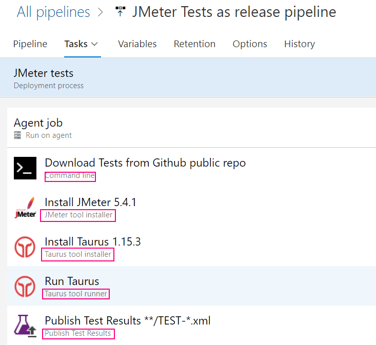

## JMeter w Azure DevOps

Azure DevOps to portal do automatyzacji procesów deweloperskich, który może korzystać z zasobów Azure (z Azure Portal) jak i spoza niego (np. GitHub) poprzez 
linki, które nazywamy Service Connections.

***

Wykonanie testów w systemie CI/CD (Azure DevOps lub innym) to nic innego jak automatyzacja. Zanim będziemy automatyzować musimy wiedzieć co automatyzujemy. Opiszmy więc zadanie w postaci kroków:

- Pobierz repozytorium z testami (wymagane)
- Zainstaluj JMetera (wymagane)
- Uruchom Testy (wymagane)
- Opublikuj wynik testów (opcjonalne)
- Opublikuj artefakty testowe (opcjonalne)

Do automatyzacji wykorzystujemy pipeline'y. Automatyzację implementujemy korzystając z gotowych elementów pipeline'a (stepów) lub rozszerzeń, które możemy zainstalować z Azure Marketplace. 

Pipeline w Azure Devops ma następującą [strukturę](https://docs.microsoft.com/en-us/azure/devops/pipelines/yaml-schema?view=azure-devops&tabs=schema%2Cparameter-schema):

```yaml

pipeline:
    stage A:
      job 1:
        step 1.1
        step 1.2
        ...
       job 2:
        step 2.1
        ...
    stage B:
      ...
```
Przykładowy prosty pipeline w YAML znajduję się w pliku [teoria-pipeline.yaml](teoria-pipeline.yaml)
Pipeline'y wykonują się na agentach. Od 3.2021 darmowe subskrypcje nie mogą korzystać z chmurowych agentów i musimy sami sobie [agenta zainstalować](../agent/teoria.md).


***

Podstawowe metody puszczania testów w Azure DevOps na agentach Microsoftu są następujące:

1. **Jako release pipeline**

    Release pipeline'y zostały stworzone do wdrażania aplikacji ale mogą też służyć do automatyzacji. Polegają na ręcznej konfiguracji i na chwilę obecną nie można ich zapisać w postaci YAML.

    

2.  **Jako build pipeline (YAML) z użyciem binarki**

    W tym podejściu definicję pipeline'u trzymamy w kodzie w pliku YAML a JMetera za każdym razem instalujemy tak jak robiliśmy to w naszym systemie.
        
    
    
3. **Jako build pipeline (YAML) z użyciem kontenera dockerowego**

     W tym podejściu nie musimy instalować JMetera. Testy zostaną uruchomione w kontenerze Dockerowym, który już go zawiera.
    
     
 
***

