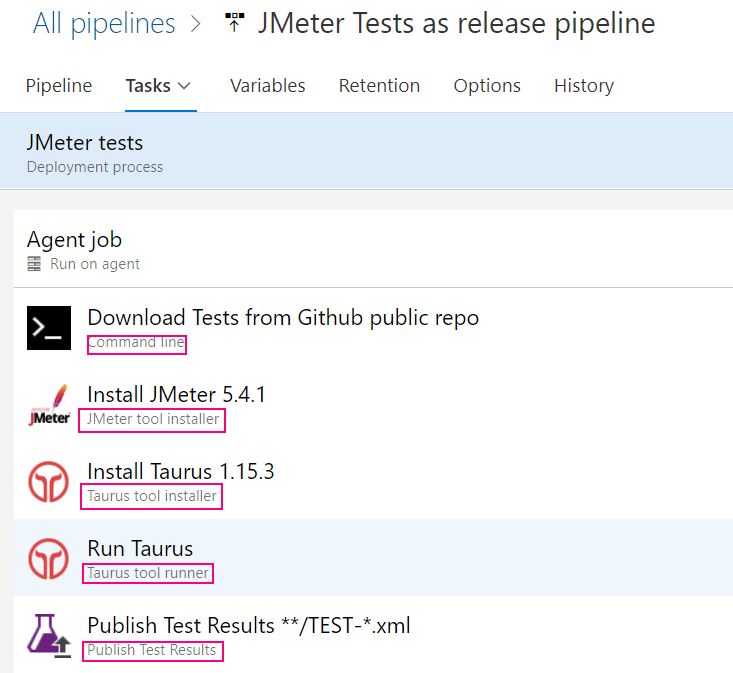

## JMeter w Azure (to demo robimy wspólnie)

1. Uruchomimy Release pipeline 

    - Z [Azure Marketplace](https://marketplace.visualstudio.com/items?itemName=AlexandreGattiker.jmeter-tasks) zainstalujemy potrzebne narzędzia
        - JMeter Installer
        - Taurus Installer/Runner
    
    - Stworzymy pipeline: Wejdź w Pipelines -> Releases -> New Release Pipeline -> Add Stage (Empty job, Jmeter tests) 
    
    - W 'Agent job' zmień 'Agent Specification' na  ubuntu latest. To nasza platforma do automatyzacji.
    - Dodaj następujące taski do pipeline'a:
    
        -   Command Line Task (download repo zip with curl):
                
             ```shell script
                curl -O -L -X GET https://github.com/gabrielstar/charity/archive/refs/heads/master.zip
                unzip master.zip             
                ls -alh 
               ```
   
         -  JMeter Installer
         -  Taurus Installer
         -  Taurus Runner (Taurus Configuration YAML):
         
            ```yaml
            execution:
            - scenario:
                script: charity-master/201_azure/test.jmx
            
            reporting:
            - module: junit-xml
              filename: taurus-output/TEST-Taurus.xml
            ```    
         - Publish Test Results
           
    - Uruchom testy tworząc nowy release i wdrażając go
            

    
`żródłó: Gabriel Starczewski`
            
***
2.  Uruchomimy i zanalizujemy [pipeline uruchamiający test z binarki](jmeter_from_binary.yaml)
     
     Najpierw sforkujemy nasze repozytorium do Azure'a, tak, żeby każdy miał swoją kopię:
     
     - Repos -> Files -> Import Repository: https://github.com/gabrielstar/charity.git
     
    Następnie załadujemy przykładowe repo:
     
     - Pipelines -> Create Pipeline -> Azure Repos Git -> Exisiting Azure pipelines YAML file -> jmeter_from_binary.yaml
    
    Na koniec klikamy 'Run'
     
3.  Uruchomimy i zanalizujemy [pipeline uruchamiający test z dockera](jmeter_from_docker.yaml)

    Instrukcje są identyczne jak powyżej. Uruchomimy pipeline ale wrócimy do niego jeszcze po module [Docker](../203_docker/teoria.md)
