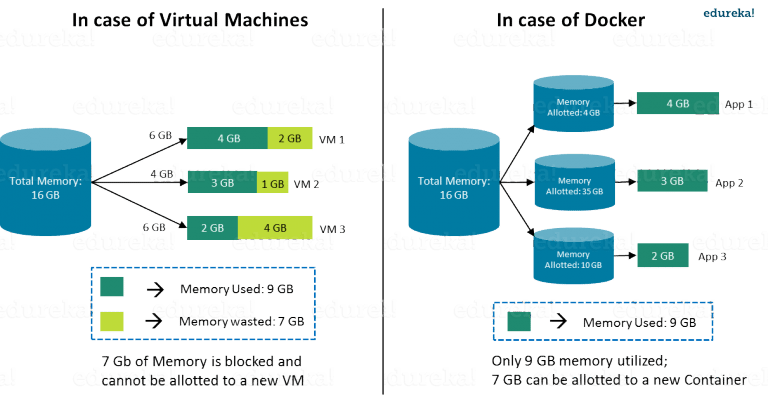

## Docker i JMeter

Zajmiemy suê budow¹ obrazu Dockerowego z JMeterem i pluginami, których u¿ywamy. To nie jest rocket science :)


Docker wzi¹³ siê z potrzeby osczêdnoœci zasobów:


     
        Ÿród³o: edureka.co
        
Podstawowymi elementami, z którym wchodzimy w interakcjê s¹ obrazy i kontenery.
        

        
        Ÿród³o: docker.com
        
        
Wiêkszoœæ deweloperów u¿ywa Dockera aby rozwi¹zaæ problem zale¿noœci systemowych. Spójrzmy na przyk³ad:

```dockerfile
 # syntax=docker/dockerfile:1
 FROM node:12-alpine
 RUN apk add --no-cache python g++ make
 WORKDIR /app
 COPY . .
 RUN yarn install --production
 CMD ["node", "src/index.js"]
```

Nawet w tak prostym pliku definiujemy obraz jako:

- pewien system operacyjny :) //to rozwi¹zuje masê problemów
- rozszerzony o programy, które doinstalowujemy
- z pewnymi ustawieniami

Podstawowe komendy dockera znajdziecie w [docker](../docker/docker.md)