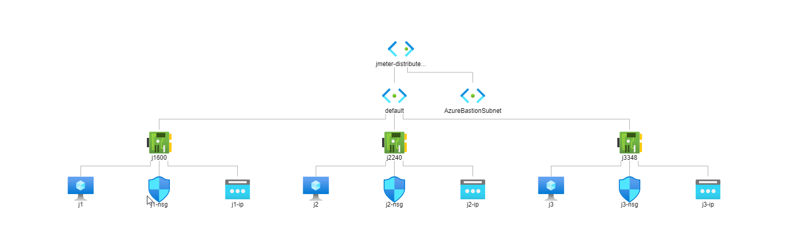

## Tryb rozproszony na maszynach w Azure (to demo robimy wspólnie)

Zbudujemy nastêpuj¹c¹ topologiê i uruchomimy nasz test w trybie rozproszonym:




1. W Azure stwórz 3 VM o nazwach j1,j2,j3 bêd¹ce w tej samej sieci wirtualnej:

    - Ubuntu 20 +
    - Z haslem do logowania zamiast SSH
     
2. Stwórz Bastion Host po stworzeniu 1 VMki, ¿eby mo¿na siê by³o pod³¹czyæ do nich z przegl¹darki (trwa to do 10 minut, dobrze iœæ wtedy na kawê)
4. Na 2 VMkach odpal jmeter-server.sh
5. Na 3-ciej odpal test, który u¿ywa IP pozosta³ych maszyn. (test mo¿esz skopiowaæ CTRL-C, CTRL-V z katalogu æwiczenia na VMkê)

Polecenia do wklejenie w konsoli Bastiona:
```shell script
#instaluj JMETERa

version=5.4.1 && \
sudo apt update && \
sudo apt install unzip && \
sudo apt install openjdk-8-jre-headless && \
curl -o ${version}.tgz http://archive.apache.org/dist/jmeter/binaries/apache-jmeter-${version}.tgz && \
tar -xzf ${version}.tgz

#sprawdŸ IP
ip addr

#komenda do uruchomienia workera
cd apache-jmeter-5.4.1/bin
./jmeter-server -Dserver.rmi.ssl.disable=true

#pusc test na montrolerze gdzie worker ip to np. 10.0.0.5
cd apache-jmeter-5.4.1/bin
./jmeter -Dserver.rmi.ssl.disable=true -n -t examples/CSVSample.jmx  -R 10.0.0.5
```

Problem przy testowaniu rozproszonym zaczyna siê pojawiaæ w momencie gdy chcemy elastycznie skalowaæ workery. 

Rozwi¹zuje siê go na kilka sposobów, korzystaj¹c z:
- VM Scale Set
- Azure Container Instances
- Azure Kubernetes Service
          

