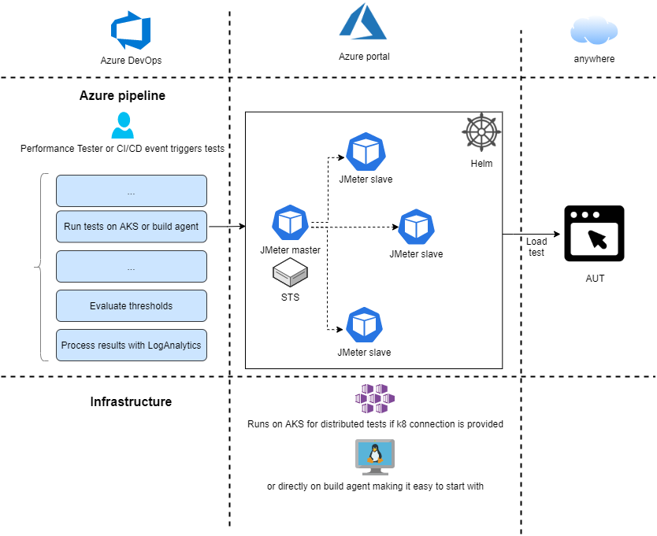

## CRUX JMeter performance framework (Opcja).

> **CRUX** (pron. kruhks) is build around Kubernetes (AKS) and JMeter. It makes it easy to incorporate performance tests into your Azure CI/CD pipeline. Each performance build can create and destroy infrastructure necessary for the run, which makes it cost effective. CRUX deploys a distributed JMeter cluster on Kubernetes (AKS) with the size you need, runs tests, destroys infrastructure. If you do not have an AKS, be at ease, you can also run JMeter tests with CRUX directly on build agent with docker.

CRUX jest automatyzacją opartą o Azure+Kubernetes, która pozwala na puszczanie testów obciążeniowych o dowolnej skali w Azure DevOps.

Wspólnie uruchomimy [CRUXA] (https://github.com/ObjectivityLtd/crux).